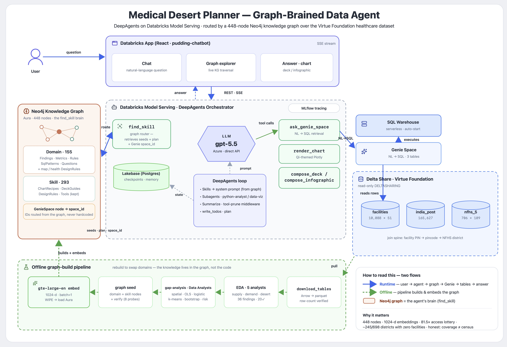

# The Pudding Agent (Graph-Based Harness Agent on Databricks Apps!)

> A full-stack data-analytics agent for the **Virtue Foundation India healthcare-access** dataset,
> built for the **Databricks Apps & Agents for Good 2026** hackathon. Track: **Medical Desert Planner**.

> ⏳ **Give the GIFs a moment to load. It will be worth it!**

First we had to create a scaffold for the harness. We used the **Deep Agents SDK by LangChain** to
build it, because Databricks does not have a sandbox natively. A virtual filesystem of **Volumes**
(to store artefacts) and **Workspaces** (to store agent-generated Databricks notebooks) was simulated,
all with **OBO-enabled** access so that every feature is personalised to the signed-in user.

The Pudding Agent helps non-technical planners pull insight on **medical deserts** and find the highest
gaps in care through four main functions:

- **Build scroll-driven narrative essays** (similar to The Pudding) over the dataset, using the Data Visualisation subagent.
- **Export PowerPoint files** for offline communication to stakeholders on the action that needs to be taken, as analysed by the Pudding Agent.
- **Create notebooks that run natively** inside the Databricks workspace for deeper data analysis, using the Python Analyst subagent.
- **Assess a live map** of the medical deserts to capture the current district access gaps.

## The Architecture

- **Ask (top):** A user asks a question in plain English in the Databricks App. It streams to our
  **DeepAgents orchestrator** on **Databricks Model Serving**, where **gpt-5.5** does the reasoning.
  **Lakebase** (managed Postgres) is the memory backbone: every turn is checkpointed there, so the
  agent is multi-turn, resumable, and stateful instead of forgetting after each message.
- **The brain (left):** Instead of hard-coding prompts or stuffing every skill into context, the agent
  retrieves only what is relevant from the **Neo4j knowledge graph**. That is the payoff: it is cheaper
  and faster, it fetches the right knowledge by intent, and it gives connected reasoning. For example
  Finding to Metric to SQL pattern to Genie space, so the model gets a joined-up plan, and the traversal
  is explainable (you can watch it in the graph explorer).
- **Answer and persist (right):** Guided by the graph, it runs `ask_genie_space` (natural language to SQL)
  over a **Databricks Agent Bricks** Genie Space (the *India Healthcare Access Space*) sitting on the
  **Virtue Foundation Delta Share** tables, then renders a chart, deck, or infographic. **Lakebase**
  persists the chat history and user feedback, shared between the app, the orchestrator, and the
  subagents as the single system of record.
- **Observe (throughout):** Every request is traced end to end with **MLflow Tracing** into a Databricks
  experiment. Each reasoning step, `find_skill` graph traversal, Genie SQL call, and rendered artifact is
  captured as a span, so runs are debuggable, token and latency cost is visible, and the agent's decisions
  stay auditable.
- **The build (bottom):** The graph itself is produced by an offline pipeline of data analysts
  (ingest to EDA to gap-analysis to embed), so it scales by adding nodes. You retarget a new dataset by
  rebuilding the graph, not the code or the prompts.

> **Where Agent Bricks fits:** the natural-language-to-SQL layer is a Databricks **Agent Bricks** Genie
> Space, and the orchestration layer is our DeepAgents agent on Model Serving. Together they are the
> reasoning-and-retrieval brain that turns a planner's question into governed SQL and a verified answer.

## The Pudding Agent in Action!

### The knowledge graph is the brain

The live graph explorer inside the app. The agent's domain knowledge is a **448-node, 3,590-relation
Neo4j graph**: Findings, Metrics, SQL patterns, Questions, chart and deck recipes, design rules, and a
single Genie-space node. When a planner asks something like *"Where is anaemia or child malnutrition
worst?"* or *"Which facilities claim advanced care they cannot back up?"*, the question **routes through
the graph** to the exact SQL pattern, metric definition, finding, and Genie space it needs. Nothing is
hard-coded: the agent fetches knowledge by intent, and you can pan, zoom, and click any node to see why
it was chosen.

### Scroll-driven narrative essays

Ask for a data story and the agent plans it on a live to-do list, runs a **knowledge-graph traversal**
(here, 74 nodes and 84 relations in three round-trips under a second), queries the **Agent Bricks Genie
Space** (*India Healthcare Access Space*), pulls the figures with governed SQL, and composes a
**scroll-driven essay** in The Pudding style. The published artifact, *"The Indian care lottery: same
country, opposite odds"*, shows the sharpest divide is health-insurance coverage: **1.2% in South Andaman
versus 97.8% in Barmer, an 81.5x spread** across 706 NFHS-5 districts. Every figure is injected from the
data, never hand-typed.

### Export PowerPoints so non-technicals can focus on what matters

The agent assembles a **6-slide PowerPoint** (find_skill, the Genie Space, and DataFrame queries, then a
summarise-and-assemble step) and hands back a real `.pptx` that opens in PowerPoint. The deck covers the
care lottery (**706 districts, 305 with zero in-dataset facilities, 43.2%**), the **Bihar versus Kerala**
burden gap (Bihar health-burden index 64.7 versus Kerala 35.7, with 9 zero-facility districts versus 0),
a priority-desert ranking, and a closing call to action. The honesty footer travels with it: *"facility
counts are coverage in the Virtue Foundation sample, not a census of all care options."*

### Run deeper analysis as a native Databricks notebook

For a harder question (*"is 'more need means fewer facilities' real, or just urbanisation? Show the
confidence"*), the **Python Analyst subagent** retrieves the inputs, pressure-tests the relationship,
builds a visual deep-dive, and writes a **reproducible Databricks notebook** that runs natively on
**serverless** in the workspace (*Generated by Orchestrator Agent*, with a Lakebase-backed variable_store
preamble and secrets pulled at runtime). It reports the result honestly: across 706 districts, 305 have
zero matching facilities (**43.2%**), a dataset-coverage signal rather than proof that no care exists.

### Assess the medical deserts on a live map

An interactive **Medical Desert Risk** map of India: a composite of health need, facility-coverage gap,
and evidence gap per district, with insight layers, a specialty lens, histogram filters, and 9,953 mapped
facilities. It surfaces **251 districts with zero mapped facility**, **210 true spatial deserts**, a
**16.6 km median distance** to the nearest facility, and a priority list (Araria, Lakhisarai, Jamui,
Pakur, and more). A "read me honestly" panel never leaves the screen: facilities are a ~10k-record
sample, this is coverage not a census, it is not per-capita, and suppressed NFHS cells encode rarity, not
absence.

## How this meets the challenge

| Challenge requirement | How the Pudding Agent delivers it |
|---|---|
| Run as a Databricks App on Free Edition | The app (`pudding-chatbot`) and the Genie Space both run on Free Edition, shown in the recordings. |
| Use the provided facility dataset | All answers are grounded in the Virtue Foundation Delta Share (`facilities`, `india_post_pincode_directory`, `nfhs_5_district_health_indicators`). |
| Clear non-technical workflows | Plain-English questions produce stories, decks, notebooks, and a map, with a live plan and to-do list. |
| Cite the underlying facility text for any important claim | Genie returns governed SQL over the source tables, and findings carry their sources; figures are injected from data, never hand-typed. |
| Communicate uncertainty instead of presenting weak evidence as fact | An honesty contract is baked into every artifact: coverage not census, no per-capita, self-reported capability, urbanisation confounding flagged. |
| Persist user actions | Lakebase (managed Postgres) checkpoints every turn and stores chat history and feedback as the single system of record. |

## Gaps in the dataset

The main data gaps we identified are:

- **Facility coverage is a sample, not a census.** The facilities table has about **10,000 India rows**, while external facility registries list **47,000+** facilities. Counts should be read as **dataset coverage**, not total healthcare supply.
- **"Zero facilities" means zero captured in this dataset.** About **245 of 698 NFHS districts** have no matched facility records in the dataset, but that does **not** mean those districts have no healthcare providers. It indicates a likely **coverage, discoverability, or matching gap**.
- **Private-sector skew is strong.** The observed facility data is overwhelmingly private: **88.4%** of India rows are private, and among facilities with known operator type, **94.9%** are private. Public-sector availability is likely under-observed.
- **No population denominator.** The available tables do not include population by district, so we should not compute per-capita facility rates or claim facility adequacy per person.
- **Facility capability fields are self-reported or scraped claims.** Specialties, procedures, equipment, and capability text are useful for signals, but they are not verified service availability.
- **District matching can introduce uncertainty.** Facilities are bridged to districts through address, PIN, and district normalisation, so unmatched or inconsistently written locations can create apparent gaps.
- **Need-versus-supply relationships are confounded by urbanisation.** A simple comparison suggests high-burden districts have fewer captured facilities, but that pattern largely reflects rural and urban structure. It should not be presented as a direct causal relationship.

**Bottom line:** the dataset is strongest for identifying **where coverage appears thin relative to health need**, but not for proving that care is absent or measuring total facility supply.

## The data

Virtue Foundation Delta Share, `databricks_virtue_foundation_dataset_dais_2026.virtue_foundation_dataset`:

- `facilities` (~10k web-discovered **sample**, not a census; 51 columns)
- `india_post_pincode_directory` (PIN to district crosswalk; 165,627 rows)
- `nfhs_5_district_health_indicators` (706 districts by 109 metrics)

Join spine: facility PIN to pincode modal district to NFHS district.

## Repo layout

| Path | What it is |
|------|------------|
| `hackathon-orchestrator-neo4j/` | DeepAgents orchestrator on Model Serving. The Neo4j `find_skill` tool routes every request to the right Genie space, SQL pattern, metric, finding, and chart/deck recipe. The graph **is** the domain knowledge. |
| `nodejs-app-v3/` | React/Express chat UI (the Databricks App). SSE streaming to the Model Serving endpoint, persistent chat history in Lakebase. |
| `hackathon-medical-desert-map/` | The standalone interactive India access-gap map (D3), served by the app. |
| `hackathon-skills/` | Domain and design-system skill files (the filesystem fallback; the live system reads from the graph). |
| `graph-build/` | Reproducible pipeline that builds the India-healthcare `find_skill` graph (domain seed, capability/skill layer, embeddings) on Neo4j Aura. |

## View the full video

Full walkthrough video: **https://www.youtube.com/watch?v=DeahUj3De_Y**
